<div align="center">

<!-- Banner -->


<br/>
<br/>

<!-- Social Badges -->
<a href="https://www.linkedin.com/in/nawabsakib" target="_blank">
  
</a>
<a href="https://github.com/nawabsakib5" target="_blank">
  
</a>
<a href="https://mail.google.com/mail/?view=cm&fs=1&to=nawabsakib5@gmail.com" target="_blank">
  
</a>

</div>

<br/>

## 👤 About Me

```python
class Sakib:
    def __init__(self):
        self.name = "Mohammad Sakib Howlader"
        self.role = "Backend & Full-Stack Developer"
        self.stack = ["Python", "Django", "C#", "PostgreSQL", "MySQL", "Redis", "Celery"]
        self.education = "B.Sc in CSE, Habibullah Bahar University College (National University)"
        self.certifications = [
            "NSDA Level-4: Web Application Development with Python (360 hrs)",
            "NSDA Level-3: Graphic Design for Freelancing (360 hrs)"
        ]
        self.currently_building = "Enterprise Madrasa Management System (Django)"
        self.interests = ["Scalable Backend Systems", "Edge AI Hardware", "Real Madrid ⚽"]

    def say_hi(self):
        return "Let's build secure, scalable & high-performance applications 🚀"
eita k sevabe sundor kore sajiye daw,
